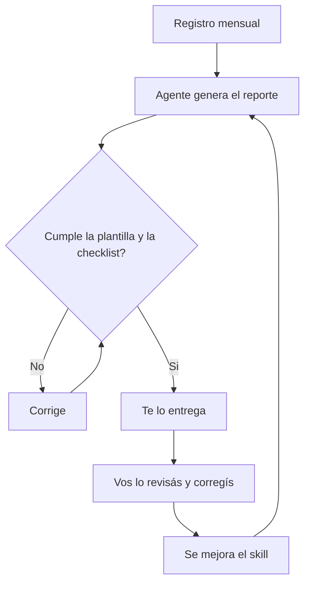

# 🧭 Caso 01 — Reporte recurrente

**Requiere: Nivel 03.** Tiempo estimado: 30 a 45 minutos la primera vez (después, minutos por mes).

## El problema

Todos los años (o trimestres) alguien te pide un reporte de lo que hiciste, y vos no te acordás. Es como la declaración de impuestos: si tenés los recibos guardados durante el año, es un trámite; si no, es una pesadilla.

"Tarea repetitiva" no significa solo "idéntica": significa **frecuente**. Anotar qué hacés cada semana o cada mes es una tarea chica y repetida; escribir el reporte grande es la tarea que querés dejar de odiar.



## Paso 1 — Un registro chiquito

Una nota por mes: `registro/AAAA-MM.md` (por ejemplo `registro/2026-10.md`). Cada semana, unas pocas líneas: qué hiciste, qué salió, qué quedó trabado. Podés escribirlas vos, o contarle a tu agente en el chat y que él las agregue.

También podés tirarle reportes viejos y links a páginas web interesantes: tu agente los ingesta al vault con etiquetas (las mismas pocas etiquetas del Nivel 03, reusando las que ya existen).

> [!TIP]
> 🧭 **Decile esto a tu agente:**
>
> ```
> Creá la carpeta registro/ y el archivo registro/[AAAA-MM].md con
> el título del mes. Voy a contarte lo que hice esta semana: agregalo
> en pocas líneas, con la fecha. Usá solo etiquetas que ya existan
> en mi vault; si necesitás una nueva, preguntame antes.
> ```

## Paso 2 — La plantilla, hecha CON vos

Dale a tu agente 1 o 2 reportes pasados que te hayan gustado, y contale qué mejorarías. Él te propone una **plantilla** (las secciones del reporte) y vos la validás o la editás. La plantilla nunca se inventa sola: es tuya.

> [!TIP]
> 🧭 **Decile esto a tu agente:**
>
> ```
> Te paso [ruta de uno o dos reportes que me gustaron]. Leelos y
> proponeme una plantilla con las secciones del reporte. Quiero
> mejorar esto: [qué querés cambiar]. No escribas nada definitivo:
> mostrame la propuesta y esperá mis cambios.
> ```

## Paso 3 — Un skill que genera el reporte

Un **skill** es una instrucción guardada en un archivo, para que tu agente repita bien una tarea sin que se la expliques de nuevo. Pedile uno llamado `generar-reporte`, con una regla clave: **se autocorrige** como un tester antes de entregarte nada.

> [!TIP]
> 🧭 **Decile esto a tu agente:**
>
> ```
> Creá un skill llamado generar-reporte que use mi plantilla y mi
> carpeta registro/. Antes de entregarme el reporte tiene que
> revisarlo contra la plantilla: (1) están todas las secciones,
> (2) cada número se puede rastrear hasta el registro, (3) no hay
> datos inventados. Si algo falla, corregilo y revisá de nuevo.
> Recién cuando pase todo, me lo entregás.
> ```

## Paso 4 — Primera entrega: la validás vos

Leé el primer reporte. Si algo no te cierra, decíselo, o pasale otro ejemplo. **Cada corrección mejora el skill, no solo ese reporte**: pedile "actualizá el skill para que la próxima vez no pase esto". Después de unas vueltas, solo vas a mirar por arriba y ajustar el skill, no el reporte.

## Paso 5 — Rutina mensual

Empezá manual: una vez por mes decile *"generá el reporte del mes"*. Programarlo para que corra solo es opcional y viene después, cuando ya confíes en el resultado.

## Checkpoint

- [ ] Existe `registro/` con al menos un mes y unas líneas reales.
- [ ] Validé una plantilla hecha con mi agente.
- [ ] El skill `generar-reporte` existe y se autocorrige antes de entregar.
- [ ] Pedí un reporte, lo revisé, y al menos una corrección terminó en el skill.
