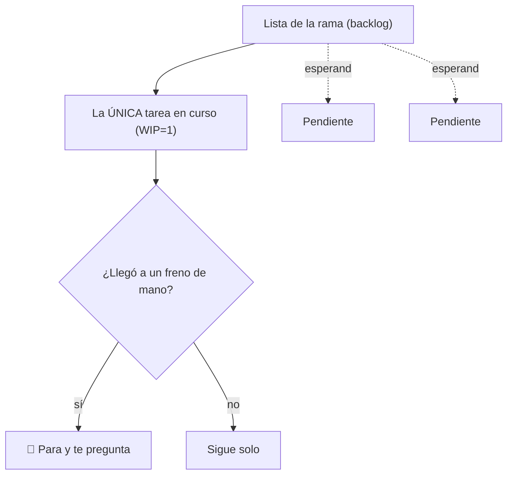

# 🧭 Nivel 04 — Vocabulario y patrones de trabajo

Cuatro palabras que van a ordenar cómo trabajás con tu agente de acá en adelante. No son palabras raras para sonar técnico — cada una resuelve un problema que aparece apenas el trabajo dura más de una sesión.

## Rama (con su backlog)

Una **rama** es un tema en el que estás trabajando, con su propia lista de cosas por hacer. A esa lista se le dice **backlog** — es como la lista del súper, pero de tareas: todo lo que falta, anotado, para no tener que acordarte de memoria.

No todo tiene que ir en la misma lista. Si estás en dos cosas distintas (por ejemplo, "aprender Python" y "organizar mis finanzas"), son dos ramas separadas, cada una con su propia lista. Igual que no mezclarías la lista del súper con la lista de trámites del banco.

## WIP = 1 (una sola cosa a la vez)

WIP son las siglas en inglés de "trabajo en curso". **WIP = 1** quiere decir: **una sola** tarea activa a la vez, por rama.

Antes de arrancar algo nuevo, terminá lo que estabas haciendo — o dejalo en pausa a propósito, diciéndolo en voz alta ("esto lo dejo para después"). Es como cocinar: si ponés siete ollas al fuego al mismo tiempo, alguna se quema. Esto evita el problema más común de todos: siete cosas a medias y ninguna terminada.

## Freno de mano

Un punto donde el agente **tiene que parar y preguntarte** antes de seguir. Se usa para dos tipos de cosas:

- **Lo que no tiene vuelta atrás** — gastar plata, borrar algo, mandarle un mensaje a otra persona.
- **Lo que solo vos podés decidir** — porque es tu vida, tu plata o tu criterio, no el del agente.

Vos elegís dónde van los frenos de mano; el agente los respeta. Es como el freno de mano del auto: no lo usás todo el tiempo, pero cuando hace falta, no se negocia.

## Día de análisis

Cada tanto (una vez por semana, por ejemplo), en vez de pedirle al agente cosas nuevas, le pedís que **relea todo lo que ya juntaron** y busque:

- Cosas que se contradicen entre sí.
- Cosas que ya no aplican (algo que era cierto hace un mes y ya no).
- Conexiones que no habías visto.

Es como ordenar el placard: si solo metés ropa y nunca sacás ni acomodás nada, al final no encontrás lo que buscás. Sin este día, un segundo cerebro que solo crece se vuelve un cajón desordenado.



## Acción

Elegí una rama real — algo en lo que estés trabajando de verdad, no un ejemplo inventado. Anotale 2 o 3 tareas en su lista, marcá cuál es la que está en curso ahora, y definí un freno de mano concreto para esa rama.

## Checkpoint

Probá dos cosas:

1. Cuando el agente llega al freno de mano, **para y te pregunta** — no sigue solo.
2. Si le pedís arrancar una segunda tarea mientras la primera sigue activa, **te lo marca** en vez de arrancarla sin más.

Si las dos pasan, el nivel está listo.

---

> [!TIP]
> 🧭 **Decile esto a tu agente:**
>
> ```
> Vamos a organizar mi trabajo así: mi rama activa es "[nombre de tu
> rama]", con este backlog: [ítem 1], [ítem 2], [ítem 3]. El ítem en
> curso ahora es [ítem 1] — WIP=1, no arranques otro ítem mientras
> este siga activo sin preguntarme primero.
>
> Freno de mano: antes de [la acción irreversible/decisión que solo
> vos tomás], parás y me preguntás explícitamente. No lo hagas solo.
> ```
