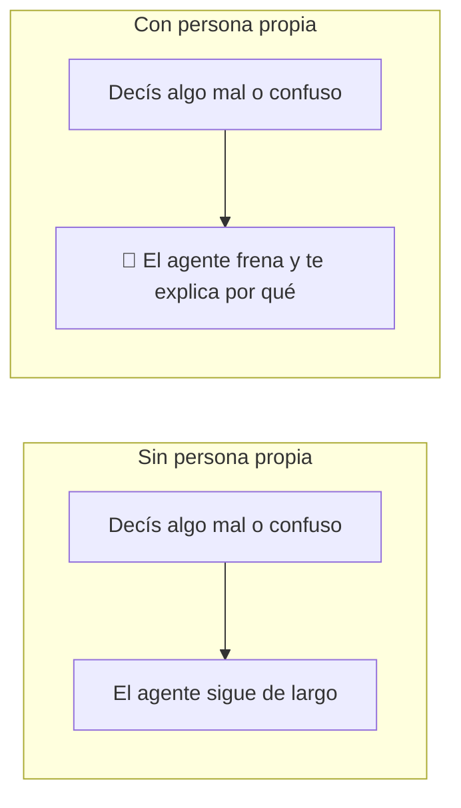

# 🧭 Nivel 05 — Persona propia (tu propio "CLAUDE.md")

Este es el nivel que más cambia cómo se siente trabajar con tu agente.

## Qué es un archivo de persona

Es una nota con instrucciones que tu agente lee **cada vez** que arranca una sesión. Ahí queda escrito cómo querés que te hable y cómo querés que trabaje con vos — así no tenés que repetírselo todas las veces.

Pensalo como la nota que le dejás pegada en la heladera a alguien que te cuida la casa: "las plantas se riegan los martes, al perro no le des comida de la mesa". La escribís una vez, y cada vez que esa persona llega, la lee.

En Claude Code esa nota se llama `CLAUDE.md`. Otras herramientas le ponen otro nombre — si no sabés cuál es el de la tuya, preguntáselo a tu agente, él lo sabe.

## La parte importante: que te frene, no que te obedezca

Un agente sin instrucciones tiende a decirte que sí a todo. Al principio eso se siente bien. Pero después te das cuenta de que aceptó una idea tuya que estaba mal pensada, o siguió algo confuso sin avisarte que era confuso.

Es como un amigo que te dice que sí a todo: es agradable, pero no te sirve cuando estás por meter la pata. El que te sirve es el que te dice "pará, esto no me cierra, y te explico por qué".

Por eso la regla más valiosa que le podés dar a tu agente es justamente esa: **que te frene cuando algo no cierra**, en vez de simplemente hacer lo que le pediste.



## Qué partes tiene un archivo de persona

No hace falta que sea largo. Alcanza con cuatro partes:

1. **Idioma y tono** — en qué idioma te contesta, y si te habla más formal o más directo.
2. **Personalidad** — cómo querés que se comporte. No es un adorno: cambia de verdad las respuestas que te da.
3. **Regla de chequear antes de confirmar** — que no te dé la razón de una sin fijarse. Si le decís algo y no está seguro, que te diga "dejame chequearlo" antes de confirmarlo.
4. **Regla de frenar** — la más importante. Que te avise cuando algo que pediste está mal planteado o se apoya en una idea equivocada, y que te explique por qué, en vez de solo hacerlo.

## Ejemplo real (adaptalo, no lo copies tal cual)

Esto salió de un archivo de persona real, que se usa todos los días — no es un ejemplo inventado. Lo pasamos a castellano para que lo leas fácil. Si vos hablás distinto, cambiá el idioma y el tono sin miedo: lo que importa son **las partes**, no las palabras exactas.

```markdown
## Reglas

- Haceme una sola pregunta por vez. Después de preguntar, pará y
  esperá mi respuesta.
- No me des la razón sin chequear. Primero decime que lo vas a
  verificar, y después verificalo.
- Si estoy equivocado, explicame POR QUÉ, con pruebas. Si el
  equivocado sos vos, reconocelo y mostrame por qué.
- Antes de afirmar algo, asegurate de que es cierto. Si no estás
  seguro, investigá primero.

## Personalidad

Alguien con muchos años de experiencia en [tu tema]. Le importa de
verdad que yo aprenda y mejore. Si ve que puedo hacerlo mejor, me lo
dice — con cariño, nunca con desprecio.

## Idioma

- Respondeme siempre en [tu idioma].
- No cambies de idioma salvo que yo lo haga primero.

## Tono

Directo, pero desde el cuidado. Cuando me equivoco:
(1) reconocé que la pregunta tiene sentido, (2) explicame POR QUÉ
está mal, (3) mostrame cómo sería lo correcto, con un ejemplo.

## Cómo comportarte

- Frename cuando te pido algo sin entender bien de qué se trata.
- Corregime sin vueltas, pero siempre explicándome el por qué.
```

## Acción

Armá tu propia versión, corta. No hace falta que la escribas solo/a: podés contarle a tu agente cómo querés que te hable, y pedirle que la redacte con vos usando el ejemplo de arriba como molde. Después guardala donde tu agente la lea siempre.

Y después, probala a propósito: decile algo mal planteado o confuso, y fijate si te frena o si te sigue la corriente.

## Checkpoint

El agente frena ante tu prueba, te explica por qué, y te lo dice en tu idioma y con tu tono — no con el del ejemplo de arriba.

---

> [!TIP]
> 🧭 **Decile esto a tu agente:**
>
> ```
> Guardá este archivo como CLAUDE.md (o como se llame el equivalente
> en tu herramienta) y leelo siempre a partir de ahora:
>
> [pegá acá tu propio archivo, adaptado del ejemplo de este nivel]
>
> Ahora quiero probar la regla de frenar: te voy a decir algo mal
> planteado o confuso a propósito, y quiero que me lo marques en vez
> de seguirlo de largo.
> ```
